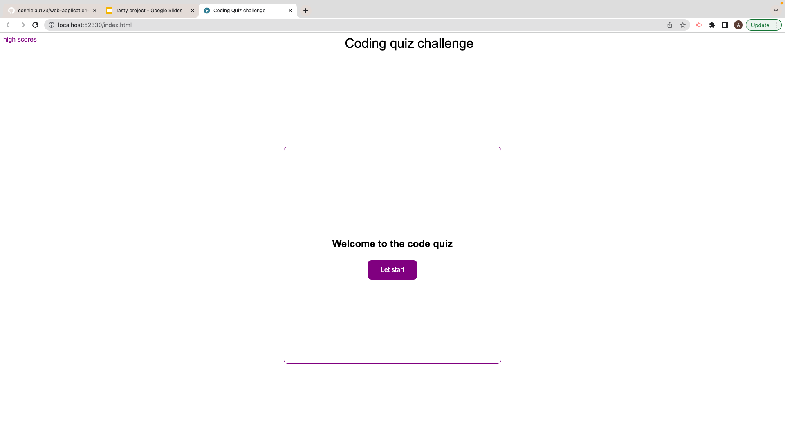
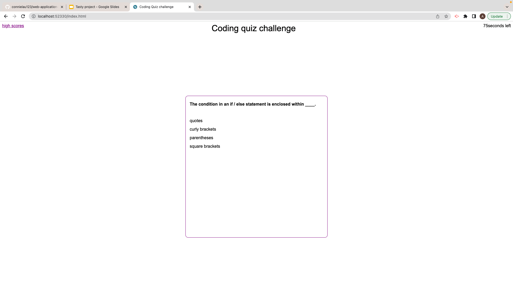
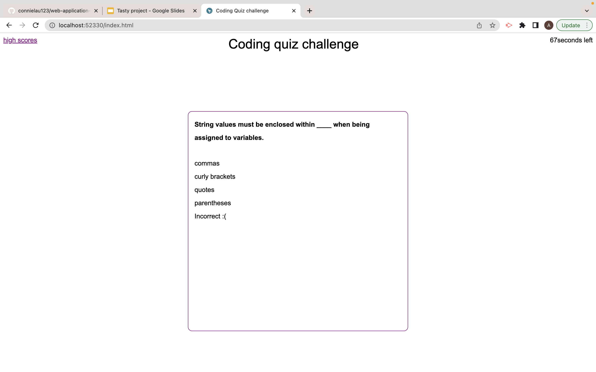

# week-4-Timed-Quiz

Customer asked for a page that allows me to test my coding knowledge and save a score with my initials.

## User Story

- As a developer I want a page that is interactive using Java Script to allow users to interact with the web page. 

- So that the user is able to answer all the question given in the quiz and save their results along side their initials to compare with others

## Acceptance Criteria

- GIVEN page that is interactive with the user to play the quiz

- WHEN JS elements are understood across search engines to allow for interaction 

- WHEN a user presses on to the start button the page navigates them through questions 

- WHEN a user is asked a question, they pick a selection and are given a correct or wrong reponse

- WHEN a user passes one question they are presented with another until the game finishes

- WHEN page allows for smooth navigation for the user 

- WHEN page When JS, CSS and HMTL link up accordingly with the page

- WHEN user runs through questions and passes the acceptance criteria to generate a password then they should be present with a new random password  

 
 

My main issue was ensuring my score was kept and saved at the end of each round then to be saved with the initials into local storage making sure that it was compatible with what I wanted the page to do in the web browser.

 

## General info
This is a page developed through HTML and later styled through CSS. The main functionality of the page comes from Java Script which allows for the interactivity by the user into the page to go through the quiz and answer the questions. The user is given a list of questions to answer under a set time limit and at the end of each game they are given a score and this score can be saved into local storage along with their initials. However, there are set criteria that the user will have to meet to be able to countinue which is finishing the game in 75 seconds if this is not done the game will end and they will finish with a score of 0.
## Page link
https://adibasjd.github.io/week-4-timed-quiz/

## MY WEB PAGE
Quiz opening page presented to user.

User is promoted for a an answer and shown a 75 seconds timer.

User is made to answer a question to countinue if the answer is wrong then the user will be told it was incorrect and be made to carry onto the next question.

User is made to answer a question to countinue if the answer is correct then the user will be told it was in
correct and be made to carry onto the next question.

A random password is generated
